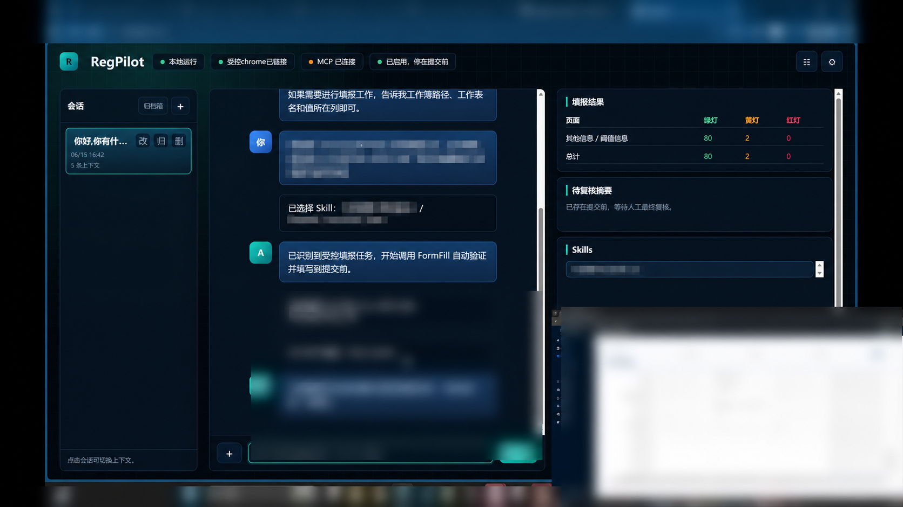

# Regpilot法规合规领航员

一个本地优先的法规证据检索与分析工作台。它把本地法规资料、来源台账和大模型分析连接成可追溯的工作流，重点展示 AI 应用工程中的上下文构建、证据约束、流式交互与会话管理。

## 作品集公开版

本仓库是可在 Windows 本地运行和验证的 **source-available portfolio**，用于个人作品展示；它不等于完整生产系统，也不是开源项目。公开源码覆盖法规工作台、证据处理、索引/台账、OpenAI-compatible 模型调用和确定性模拟填报；真实浏览器、生产填报工作簿、企业平台适配器与生产填报链路未公开。

请先阅读 [作品集公开版说明](docs/PORTFOLIO_EDITION.md)，其中列出了代码可验证能力、配套演示材料边界、最短验证路径、数据与隐私边界以及使用限制。



> 上图来自完整本地集成原型，已对真实数据和环境信息脱敏。公开仓库提供可运行的法规工作台与确定性模拟填报链路，不包含图中连接生产页面的受控浏览器适配器。

## 当前稳定边界

- 摄取用户明确提供的 `md/txt/html/htm/json/jsonl/csv/docx/xlsx` 以及可提取文本的 PDF。
- 对本地证据进行检索、引用和证据包构建。
- 使用 OpenAI-compatible API 生成受证据约束的法规分析与报告。
- 维护法规来源台账、去重、历史记录并导出 JSON/CSV。
- 本地保存会话和模型设置；API Key 不进入仓库。
- 内置确定性的模拟填报适配器，用于展示字段校验、人工介入和提交前停止合同。

公开版不会启动受控 Chrome、接入生产填报工作簿或访问企业/生产填报网站。上文的 `.xlsx` 支持仅用于法规资料证据摄取；模拟填报器不会打开或写入该路径。真实网页自动化、生产映射和 Cookie/浏览器 Profile 只存在于私有源码与本地机密数据区。

作品集配套截图或视频展示的是完整本地集成原型，不代表这些私有适配器已包含在本仓库中；本公开仓库固定使用确定性模拟填报器。两者的对应关系见 [作品集公开版说明](docs/PORTFOLIO_EDITION.md)。

## 快速启动

```powershell
python -m venv .venv
.\.venv\Scripts\Activate.ps1
python -m pip install -e .
regpilot-launcher
```

默认在本机浏览器打开工作台。未配置模型时仍可验证工作台、会话、Skills 清单和模拟填报；通过自然语言执行法规资料检索、台账整理和证据约束分析需要自行配置模型 API。底层证据与台账能力可在不访问外部 API 的测试中验证。

## 演示视频

以下视频展示完整本地原型运行效果，涉及真实环境的信息已经脱敏。


https://github.com/user-attachments/assets/b0a62114-227b-471d-b05a-936faac663fc


## 文档

- [作品集公开版说明](docs/PORTFOLIO_EDITION.md)
- [运行手册](docs/RUNBOOK.md)
- [架构说明](docs/ARCHITECTURE.md)
- [作品边界速览](docs/PORTFOLIO_SCOPE.md)
- [演示脚本](docs/DEMO_SCRIPT.md)
- [远期架构路线图](docs/roadmap/adr_regpilot_market_access_risk_prevention_architecture.md)

## 验证

```powershell
python -m unittest discover -s tests -p "test_*.py"
```

测试中的路径、工作簿名和密钥均为合成占位值，不对应真实账号、客户文件或生产凭据。

## 发布状态

这是仅供作品评估的 source-available 源码展示仓库，不是开源软件，也不自动授予复制、再发布或商业使用许可。请阅读 [LICENSE](LICENSE) 与 [THIRD_PARTY_NOTICES.md](THIRD_PARTY_NOTICES.md)。
