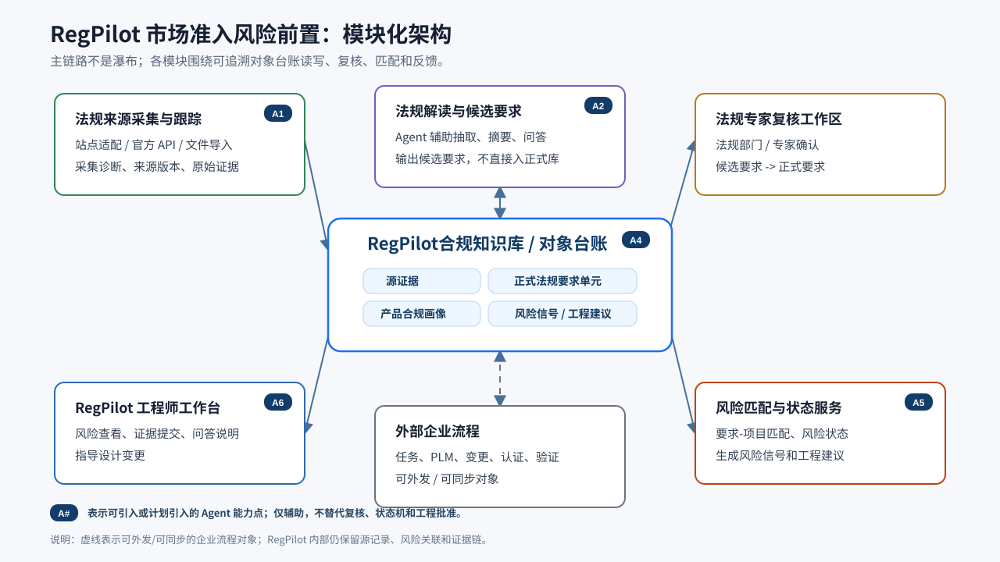
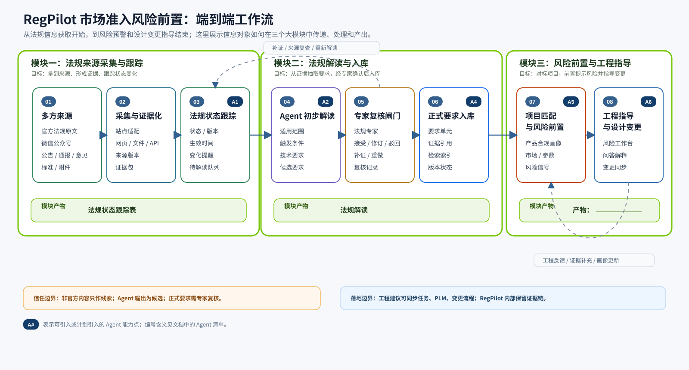
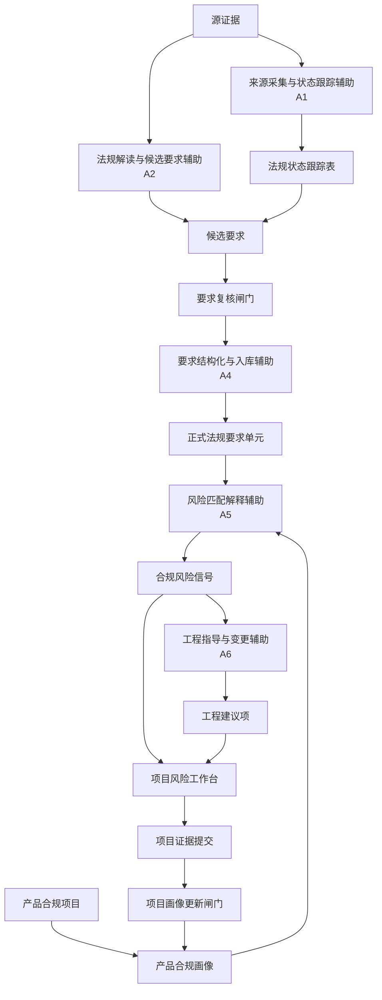
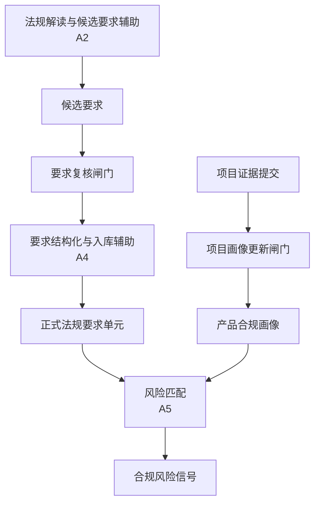

# ADR: RegPilot 市场准入风险前置架构

## 状态

已接受

## 背景

RegPilot 的长期目标不只是采集法规，也不只是回答关于文档的问题。目标架构是面向工程师的市场准入风险前置系统，用于支持车辆、平台、系统、零部件或功能设计在全球目标市场中的法规合规判断。

期望工作流是：

```text
法规搜集 -> 法规解读 -> 风险预警 -> 指导变更
```

这带来几个架构张力：

- 以法规为中心的知识库很有用，但它本身不能告诉工程师某个产品设计是否存在市场准入风险。
- 以聊天为中心的助手很方便，但它会隐藏项目状态、风险状态、证据缺口和待处理工程行动。
- Agent 推理适合解读和说明，但采集、证据保管、复核闸门、风险生命周期和同步边界必须保持确定性、可审计。
- 法规解读可以产出有价值的草稿结构，但正式风险匹配不能把未经复核的模型输出当作权威法规要求。

## 决策

RegPilot 被定位为整体的工程师市场准入风险前置工作台。顶层业务对象是**产品合规项目（Product Compliance Project）**，不是法规文档、聊天会话或来源采集运行。

法规来源采集保持为上游供给能力。它把源证据和法规记录输入 RegPilot 的知识流，但在架构上独立于工程师面对的项目风险工作流。

法规解读首先产出**候选要求（Requirement Candidate）**。法规部门工作人员或认证专家必须通过**要求复核闸门（Requirement Review Gate）**复核这些候选要求，然后它们才能成为合规知识库中的正式**法规要求单元（Regulatory Requirement Unit）**。只有经过复核的法规要求单元才能参与正式项目风险匹配。

项目风险由**合规风险信号（Compliance Risk Signal）**表示，它由经过复核的法规要求单元与**产品合规画像（Product Compliance Profile）**匹配产生。风险信号可以在专家确认前出现在工程师工作台中，但必须带有可见的**风险确认状态（Risk Confirmation State）**，例如系统识别、专家确认、已驳回/不适用、需要项目输入。

工程跟进由**工程建议项（Engineering Guidance Item）**表示。它是可审计建议，不是自动设计决策。它在架构上可以向企业任务、PLM、变更、认证或验证流程同步，同时 RegPilot 保留源记录、风险关联和证据链。

## 模块化架构图



这张图只表达模块之间的读写和依赖关系，不表达单向流程。合规知识库/对象台账位于中心，其他模块围绕它提交、复核、匹配、消费或同步对象。为了让图保持可读，模块内部细节放在后面的说明和表格中。

关键耦合关系是：

| 模块 | 与对象台账的关系 | 关键边界 |
| --- | --- | --- |
| 法规来源采集与跟踪 | 写入源证据、法规记录、采集诊断、来源版本和状态跟踪信息 | 不直接判断项目风险 |
| 法规解读与候选要求 | 读取源证据，写入候选要求和解释材料 | Agent 输出只能作为候选，不自动成为正式要求 |
| 法规专家复核工作区 | 读取候选要求，确认后写入正式法规要求单元 | 只允许法规部门工作人员或专家操作 |
| 风险匹配与状态服务 | 读取正式要求和项目画像，写入风险信号、风险状态和工程建议 | 风险状态必须可追溯到要求、画像和证据 |
| RegPilot 工程师工作台 | 读取风险和建议，写入项目证据提交和画像更新请求 | 面向工程师，不承担法规权威复核 |
| 外部企业流程 | 接收或同步工程建议、任务、变更、认证和验证对象 | 可外发/可同步，但 RegPilot 内部保留源记录和证据链 |

## 端到端工作流图



这张图故意保留“瀑布/流水线”形式，用来表达信息如何从多方来源进入系统，经过三个大模块逐步处理，最终变成工程师可以执行的设计变更指导。它和上面的模块化架构图互补：模块图回答“系统有哪些能力单元”，工作流图回答“信息如何被处理和传递”。

| 大模块 | 包含的小节点 | 模块产物 | 说明 |
| --- | --- | --- | --- |
| 法规来源采集与跟踪 | 多方来源 -> 采集与证据化 -> 法规状态跟踪 | 法规状态跟踪表 | 暂不限定产物形态；重点是记录来源、版本、状态、生效时间、变化提醒和待解读队列。 |
| 法规解读与入库 | Agent 初步解读 -> 专家复核闸门 -> 正式要求入库 | 法规解读 | 解读产物必须来自源证据，并经过法规部门工作人员或专家复核后才能进入正式要求库。 |
| 风险前置与工程指导 | 项目匹配与风险前置 -> 工程指导与设计变更 |  | 该模块产物暂留空，后续结合实际工程工作台形态再命名。 |

## 核心对象关系图



对象关系说明：

1. **源证据**支持候选要求，也继续作为正式法规要求单元、风险信号和工程建议的证据链来源。
2. **候选要求**必须经过要求复核闸门，才能成为正式法规要求单元。
3. **产品合规项目**通过产品合规画像参与风险匹配；画像不是完整 PLM，而是用于法规对标的最小事实切片。
4. **项目证据提交**必须经过项目画像更新闸门，才能更新产品合规画像。
5. **合规风险信号**由正式法规要求单元和产品合规画像共同产生，随后被项目风险工作台消费。
6. **工程建议项**由风险信号派生，可以进入工程师工作台，也可以向外部企业流程同步。
7. **项目风险工作台**不仅展示风险，也会反向触发项目证据提交，从而让画像和风险匹配持续更新。

## 关键对象与能力职责边界

前面的模块化图和工作流图已经分别表达了“有哪些能力单元”和“信息如何流动”。本节不再定义新的层级编号，而是说明各类对象和能力边界在合规知识库/对象台账周围如何分工。

| 边界 | 主要输入 | 主要输出或持有对象 | 说明 |
| --- | --- | --- | --- |
| 法规来源采集与状态跟踪 | 官方站点、公告、标准、通报、文件、采集诊断 | 源证据、法规记录、来源版本、采集状态、状态变化提醒 | 负责“拿到什么”“可信到什么程度”和“状态是否变化”，不负责工程风险判断 |
| 源证据与法规记录 | 源材料、附件、页面、表格、来源诊断 | 可追溯证据链、法规记录、版本记录 | 后续解读、复核、风险说明都必须能回到这里 |
| 候选要求、复核闸门与正式法规要求单元 | 源证据、候选要求、专家意见 | 正式法规要求单元、驳回记录、补证请求 | Agent 可以辅助抽取，最终确认必须由法规人员/专家完成 |
| 产品合规项目、画像与项目证据提交 | 项目范围、产品区域、系统、部件、功能、参数、提交证据 | 产品合规项目、产品合规画像、画像更新记录 | 画像是法规匹配所需的最小事实切片，不等于完整 PLM |
| 合规风险信号与工程建议项 | 正式要求、产品画像、证据链、风险状态 | 合规风险信号、工程建议项、确认状态、生命周期记录 | 把法规要求映射到具体项目，并形成可解释的工程行动 |
| RegPilot 工作台与外部企业流程 | 风险信号、工程建议、画像缺口、问答上下文 | 工程师反馈、证据提交、画像更新请求、外部流程同步对象 | 工程师面对的主客户端消费风险并推动设计变更；外部企业流程只接收或同步对象 |

### 法规来源采集与状态跟踪

法规来源采集与状态跟踪负责采集公开法规、标准、通报、公告、征求意见和相关材料，并维护来源版本、状态、生效时间、变化提醒和待解读队列。它可以包含站点专属适配器、浏览器协助流程、官方 API、文件导入或其他来源机制。

这个边界负责：

- 来源发现和采集运行；
- 来源级诊断；
- 原始证据保留；
- 来源版本或变化检测；
- 向 RegPilot 暴露采集状态、版本变化和待解读队列。

这个边界不负责：

- 项目风险决策；
- 工程指导；
- 最终法规解读权威；
- 工程师面对的项目工作流。

### 源证据与法规记录

源证据与法规记录保存原始证据、法规记录和版本记录。它们的存在是为了让后续解读、复核、风险说明和工程建议都能追溯到具体来源材料。

证据必须足够稳定，能够回答：

- 这个要求来自哪里？
- 使用的是哪个来源版本？
- 哪段源文本、哪一页、哪个附件、哪个表格或哪个诊断支持它？
- 来源采集是成功、部分成功，还是存在可见诊断？

### 候选要求、复核闸门与正式法规要求单元

法规解读可以使用 Agent Skill 和基于源证据的工具，从证据中抽取结构。关键边界是：解读输出首先是**候选要求（Requirement Candidate）**。

要求复核闸门由法规部门工作人员或认证专家操作，不由使用项目风险工作台的一线工程师操作。

复核闸门可以：

- 接受候选要求；
- 在接受前修订候选要求；
- 驳回候选要求；
- 打回重做；
- 要求补充更多证据。

只有被接受的候选要求才能成为**法规要求单元（Regulatory Requirement Unit）**。法规要求单元不是独立的流程层，而是进入合规知识库/对象台账的权威对象，是下游匹配和风险工作的机器可用核心。

法规要求单元应携带足够结构，以支持匹配和说明：

- 来源法规、条款、版本和证据引用；
- 适用范围；
- 触发条件；
- 技术要求或限制；
- 认证、试验或证据要求；
- 生效日期或过渡期；
- 受影响的市场、产品区域、系统、零部件、功能或参数；
- 工程行动提示；
- 核验状态。

### 产品合规项目、画像与项目证据提交

产品合规项目是项目侧顶层业务锚点。一个项目可以是车辆、平台、产品项目、系统、零部件、功能或设计项目。

产品合规画像是用于匹配的最小项目事实切片。它刻意比完整 PLM 或整车配置数据库更窄。它可以包含：

- 产品/项目身份；
- 目标市场或法规体系；
- 上市、认证或市场进入时间窗口；
- 产品类别；
- 关键技术特征；
- 设计状态；
- 已有项目证据。

如果某个风险需要更多项目信息，工程师提交**项目证据提交（Project Evidence Submission）**。该提交不会直接覆盖产品合规画像。它必须通过由授权项目角色操作的**项目画像更新闸门（Project Profile Update Gate）**，之后重新匹配才能把它作为正式项目事实使用。

### 合规风险信号与工程建议项

合规风险信号由经过复核的法规要求与产品合规画像匹配产生。

风险信号应说明：

- 它影响哪个产品合规项目和画像；
- 哪个法规要求单元触发了它；
- 哪个适用条件被满足；
- 检测到了什么“法规要求 vs 项目事实”的差距；
- 严重度和时间紧急度；
- 受影响的市场、系统、零部件、功能、试验或认证材料；
- 建议下一步动作；
- 证据链；
- 风险确认状态。

工程建议项把一个或多个风险信号转化为可复核的工程跟进建议。它们是建议，不是自动设计决策。它们可以同步到企业工作流系统，但 RegPilot 保留证据链和风险关联。

### RegPilot 工作台与外部企业流程

RegPilot 工作台是面向工程师的整体市场准入风险前置产品体验。

它包括：

- 项目风险工作台；
- 项目风险概览；
- 合规风险信号；
- 工程建议项；
- 证据缺口；
- 要求和证据视图；
- 解读报告和其他产物；
- 内嵌 RegPilot 助手。

助手是内嵌能力，不是整个产品本体。工程师不应该必须对着空白聊天框提问，才能知道已有项目状态、风险状态、证据缺口和工程建议。

外部企业流程可以接收或同步工程建议、任务、变更、认证和验证对象，但不承载 RegPilot 的 Agent 节点，也不替代 RegPilot 内部的源记录、风险关联和证据链。

## Agent 职责边界

Agent 能力用于来源采集与状态跟踪辅助、法规解读、要求入库辅助、风险解释、工程建议起草和问答说明等有价值的环节。

图中的 Agent 标记收敛为 `A1`、`A2`、`A4`、`A5`、`A6` 五个能力点。它们是辅助能力，不是新的权威事实源，也不是自动审批节点。

| 标记 | Agent 能力点 | 主要出现位置 | 主要用途 | 必须遵守的边界 |
| --- | --- | --- | --- | --- |
| A1 | 法规来源采集与跟踪 Agent | 法规来源采集与跟踪；法规状态跟踪 | 辅助整理来源采集诊断、来源版本、状态变化、生效时间、变化提醒和待解读队列，并维护法规状态跟踪表 | 不能把非官方内容当成法规事实；不能替代来源确认、源证据保留、版本记录或状态记录的确定性服务 |
| A2 | 法规解读与候选要求 Agent | 法规解读与候选要求；Agent 初步解读 | 从源证据中抽取适用范围、触发条件、技术要求、证据要求、生效时间和争议点，生成候选要求、摘要和问答材料 | 只能产出候选要求，不能直接写入正式要求库 |
| A4 | 要求结构化与入库辅助 Agent | 合规知识库/对象台账；正式要求入库 | 对已复核要求做标签建议、适用范围归一化、版本差异提示、重复检测和检索索引辅助 | 不能制造未经复核的正式要求；结构化结果必须可追溯 |
| A5 | 风险匹配解释 Agent | 风险匹配与状态服务；项目匹配与风险前置 | 辅助解释要求为什么适用于某个项目，提示画像缺口、参数冲突、过渡期和影响范围 | 不能替代确定性匹配服务、风险生命周期状态机和权限策略 |
| A6 | 工程指导与变更辅助 Agent | RegPilot 工程师工作台；工程指导与设计变更 | 面向工程师做问答、证据链解释、工程建议起草、任务/PLM/变更草案和证据补充提示 | 不能替代工程审批、设计决策或正式项目批准；外部企业流程只接收或同步对象，不承载 Agent 节点 |

Agent 可以：

- 帮助把源证据解读成候选要求；
- 辅助整理来源采集诊断，并维护法规状态跟踪表中的来源、版本、状态、生效时间、变化提醒和待解读队列；
- 解释为什么存在某个风险信号；
- 总结不同市场或不同版本之间的差异；
- 辅助起草工程建议项；
- 基于已批准要求、项目画像、风险信号和证据回答工程师问题；
- 协助准备报告、清单和复核材料。

Agent 不能替代：

- 来源采集适配器；
- 证据保管；
- 法规版本记录；
- 要求复核闸门；
- 产品画像更新闸门；
- 风险生命周期状态机；
- 权限检查；
- 通知策略；
- 正式项目批准或工程批准。

架构必须防止隐藏的模型记忆成为法规事实、项目事实、风险状态或工程决策权限的来源。

## 信任闸门



架构中有两个必要信任闸门：

- **法规信任闸门**：候选要求必须先由法规/认证专家复核，才能成为法规要求单元。
- **项目信任闸门**：项目证据提交必须先由授权项目角色接受，才能更新产品合规画像。

这些闸门用于保护风险引擎，避免它把未经复核的解读输出或非正式项目说法当成正式事实。

## 客户端表面

架构中至少有两个分离的客户端表面：

| 表面 | 主要用户 | 目的 |
| --- | --- | --- |
| 法规专家复核工作区（Regulatory Expert Review Workspace） | 法规部门工作人员、认证专家 | 在候选要求进入正式要求库前进行复核。 |
| 项目风险工作台（Project Risk Workbench） | 工程师、项目团队、市场准入相关人员 | 消费已确认要求、风险信号、证据缺口、工程建议和 RegPilot 辅助能力。 |

这两个表面不应合并。工程师可以查看要求和风险说明，但正式要求接受不在工程师面对的项目工作台中完成。

## 知识存储边界

合规知识库（Compliance Knowledge Store）按事实类型分层，并通过稳定引用连接。它不是单一向量库，也不是文档堆。

逻辑层包括：

- 源证据；
- 法规记录和版本；
- 候选要求和复核结果；
- 法规要求单元；
- 产品合规项目和画像；
- 项目证据提交；
- 合规风险信号；
- 工程建议项；
- 会话和产物。

检索索引可以支持搜索、匹配辅助和 Agent 上下文构造，但检索索引不是事实、要求、风险状态、指导状态或项目画像值的权威来源。

## 备选方案

### 以法规为中心的知识库

拒绝作为顶层架构。它可以帮助用户查找和解读法规，但不能自然地产生项目特定的市场准入风险前置能力。

### 聊天机器人优先的 RegPilot

拒绝作为主要产品形态。聊天适合解释和跟进，但如果用户没有问对问题，它会隐藏风险状态、证据缺口、待处理建议和项目上下文。

### Agent 拥有端到端工作流

拒绝。Agent 推理很有价值，但采集、证据保管、复核闸门、匹配记录、生命周期状态和同步边界需要确定性、可审计的服务。

### 模型直接抽取为正式要求

拒绝。解读输出必须经过人工专家复核，才能成为正式法规要求单元。

### 单一混合知识库

拒绝。把源证据、要求、项目事实、风险状态、工程建议和会话混在一个无差别存储中，会让审计、匹配、复核和生命周期控制变得脆弱。

## 后果

- RegPilot 的主要产品模型是项目风险前置，不是文档聊天。
- 法规来源采集可以作为上游能力独立演进。
- 正式风险匹配依赖经过复核的法规要求单元，而不是原始解读输出。
- 工程师可以尽早看到系统识别的风险，但风险确认状态必须可见。
- 项目事实必须经过提交和更新闸门，才能改变产品合规画像。
- 工程建议可以向外同步，但 RegPilot 保留证据链和源头风险关联。
- 架构需要区分专家复核表面和工程师面对表面。
- 检索和 Agent 上下文应从权威分层记录构建，不能被当成记录本身。

## 非目标

本 ADR 不决定：

- 数据库技术；
- API 形态；
- 具体来源适配器实现；
- 调度实现；
- 精确 UI 布局；
- 外部 PLM/任务系统集成协议；
- 每个对象的详细字段 schema；
- 第一条实现切片。

这些决策应在本架构边界被接受后另行讨论。
